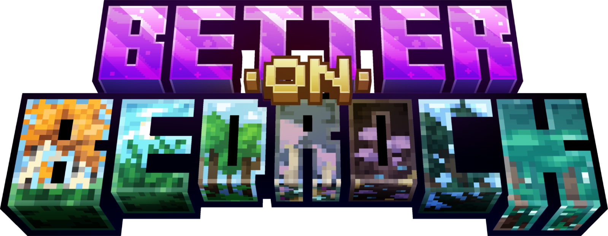

<div align="center">
  

  # Better on Java
  A port of the [Better on Bedrock](https://www.minecraft.net/en-us/marketplace/pdp?id=6c3a6979-dc77-41c6-b19e-0071dabedf71) add-on on Minecraft: Java Edition.
</div>

> [!NOTE]
> This project was made for fun and is not actively maintained.
> A precompiled build is not provided, but you're welcome to build it yourself from the source.

## Building from Source
This project uses **Gradle**. To build it:

```shell
./gradlew build
```
Your compiled mod `.jar` will appear in the `build/libs/` folder.
> If you're on Windows, use `gradlew.bat` instead.

Make sure you have:
- Java 21 or higher installed
- A compatible mod development environment (e.g., IntelliJ IDEA or Eclipse)

## License
This project is open-source under the **GNU Lesser General Public License v3.0 (LGPL-3.0)** — see [LICENSE](./LICENSE.md) for details.

You are free to use, modify, and distribute this software, including in proprietary applications, as long as any modifications to this library itself are released under the same LGPL-3.0 license.

## Contributing
```shell
# Fork the repository
git clone https://github.com/FoxyStar-Studios/Better-on-Java.git

# Create a new branch
git checkout -b feature-branch

# Commit your changes
git commit -m "Added new feature"

# Push to GitHub
git push origin feature-branch

# Submit a Pull Request
```
